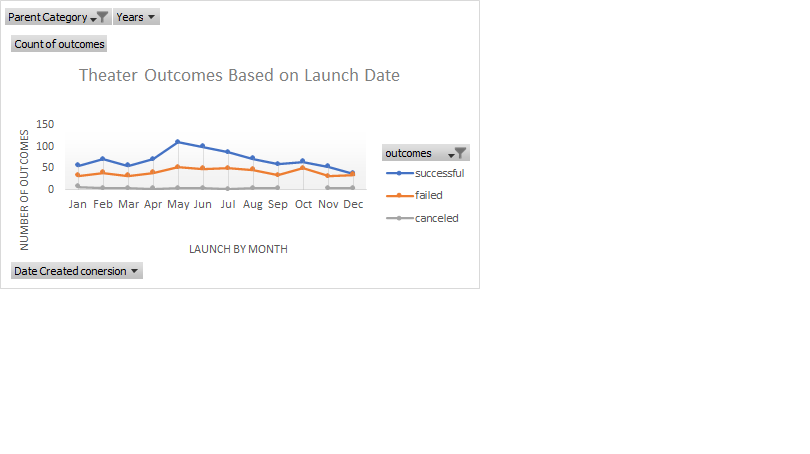
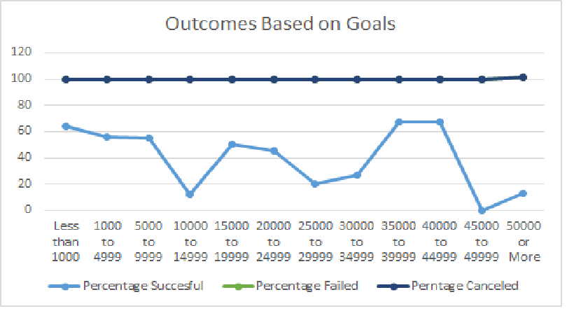

# Kickstarter_challenge
# Kickstarting with Excel

## Overview of Project
 1. Check the data for analysis.
 2. Apply filters, conditionaly fomatting and formuls to find year, percentage,etc. and resize the data.A
 3. Generate pivot tablet and interpret the table.
 4. Create pivot chart based on pivot table for visualization purpose.
 5. Calculate summary statistics ,such as  variance, central tendency.
 6. Interpret Excel visualization.

### Purpose
The purpose of this Kickstarter data analysis is to determine the timeframe of Louise's play (Fever) fundrise.
In the first analysis, it was determined the luanch date and what are the outcomes, like successful,live, failed or canceled. All the outcomes had heavy influences on the goal amount . In the second analysis, we were determined the number of successful, failed, and canceled outcomes and as well we determined the percentage of these outcomes. 
## Analysis and Challenges

### Analysis of Outcomes Based on Launch Date

 Based on this analysis, Louise's main interest is on the theater data. This data was filtered by this particular cataegory from the pivot table and result of the outcomes( successful,failed and failed).

 In order to find it, first you need to separtae parent category and subcategory, , and create a new columns for each. Then by using  create date created conversion formula, need to find out date and the particular year. Using conditional formating, we can modify / change the coloe of the outcome range like green for successful, yello for canceled and peach color for failed, in order to distinguish.
 At last, using ROUND formuls , we will find the percentage funded by using goal column and pledged column.

### Analysis of Outcomes Based on Goals

By looking at the above visualization chart, Louise's main interest is in th eplayes subcategory, so additional filters was applied. Here's goals were ranged into grops od $5000. Thne by the use of COUNTIF  function , we will be able to find the number of suceesful, failed and canceled outcomes. Then with the help of SUM functiona and round function, able to find the percentage of successful, failed and canceled outcomes.

the percentage of canceled outcomes were all zeros, which mighte be indicate that there was a cxhance of error, but the fourmula was checked again and verified as well. So it was conconfiem that there was no cancaellation in the play subcategory.

### Challenges and Difficulties Encountered

The main challenge was to figure it out COUNTIF formula form two different sheet, crieteria and find out number of successful, failed and canceled. 

## Results

- What are two conclusions you can draw about the Outcomes based on Launch Date?

 1. By looking at the graph, the successful months for the theater project are May and June.
 2. There are also few cancelation throughtout the year.

- What can you conclude about the Outcomes based on Goals?

By looking at the graph, the most successful percentage outcomes based on goals  are between $35000 and $40000. 

- What are some limitations of this dataset?

The limitation of this dataset is that there is limited amount of canceled playes in the subcategory.

- What are some other possible tables and/or graphs that we could create?

1. we can create new calculated column by using the number of months and days between launch date and deadline date, and create an exacel chart for the visualization.
